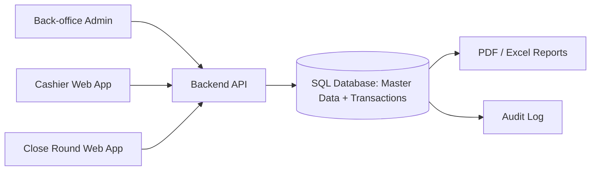

# แผนพัฒนา Web App ระบบแคชเชียร์และปิดรอบ

วันที่วิเคราะห์: 17 กรกฎาคม 2026  
ฉบับตรวจทานสมบูรณ์: เพิ่มกติกาเอกสาร/ภาษี, Refund, เงินสดประจำกะ, Concurrency, Offline Draft, PDPA และปรับสูตรยอดไม่ให้หัก Deposit ซ้ำ

เอกสารฉบับนี้จัดทำจากไฟล์ Excel 3 ชุดที่ได้รับ โดยมีเป้าหมายเพื่อเปลี่ยนกระบวนการเดิมที่อาศัย Spreadsheet ให้เป็น Web App ที่เชื่อมต่อระบบหลังบ้านและฐานข้อมูล SQL โดยตรง กรอกข้อมูลครั้งเดียว คำนวณยอดแบบเดียวกันทุกหน้าจอ และสร้างรายงานปิดรอบส่งบัญชีได้จากข้อมูลธุรกรรมจริง

## 1. เป้าหมายของระบบ

- ให้พนักงานแคชเชียร์เลือกห้อง รายการสินค้า/บริการ และราคาได้จากข้อมูลกลาง
- คำนวณจำนวนเงิน ส่วนลด เงินมัดจำ ยอดคงเหลือ และช่องทางชำระเงินโดยอัตโนมัติ
- บันทึกข้อมูลรายการขายและใบเสร็จ/Invoice เป็นธุรกรรมถาวร ไม่หายเมื่อมีการแก้ไฟล์
- สร้างหน้าปิดรอบจากรายการที่บันทึกแล้ว โดยไม่ต้องคัดลอกข้อมูลด้วยมือ
- แยกสิทธิ์ผู้ใช้งาน รองรับการตรวจสอบย้อนหลัง และส่งออกเอกสารให้ฝ่ายบัญชี
- ใช้ SQL เป็นฐานข้อมูลหลักตั้งแต่เริ่มต้น โดยข้อมูลเบื้องหลังทั้งหมดอยู่ในระบบหลังบ้านที่ตั้งค่าไว้ ไม่แยกเป็น Google Sheet

## 2. ขอบเขตจากไฟล์ปัจจุบัน

| ไฟล์ | บทบาทปัจจุบัน | ข้อมูล/หน้าที่ที่พบ |
|---|---|---|
| `DATA.xlsx` | Master Data | รายการ Villa, ประเภทห้อง, ราคา, Package, อาหาร/เครื่องดื่ม, Minibar, Souvenir, Activities, พนักงานต้อนรับ, ช่องทางชำระเงิน และรายการ Dropdown |
| `หน้าเเคชเชีย.xlsx` | หน้ารับชำระเงิน/ออกบิล | ข้อมูลใบ Invoice, ลูกค้า, วันเข้าพัก, รายการสินค้า/บริการ, จำนวน, ราคา, Deposit, Discount และ Total |
| `หน้าปิดรอบ.xlsx` | รายงานส่งบัญชี | สรุปรายได้ตาม Villa/ลูกค้า/หมวดรายได้, Deposit, ยอดคงเหลือ, ช่องทางชำระเงิน และผลต่าง/ค้างชำระ |

### รายละเอียดที่ใช้เป็นฐานออกแบบ

- `DATA.xlsx` มีชีต `DATA` เพียงชีตเดียว และรวมข้อมูลหลายชุดไว้ในช่วงคอลัมน์/แถวเดียวกัน เช่น รายการราคาอยู่ช่วง `B17:D255` ส่วนรายการเลือกต่าง ๆ อยู่คอลัมน์ `S:AJ`
- หน้าแคชเชียร์ใช้รายการสินค้าในบรรทัดประมาณ `16:55` โดยมี `Category`, `QTY`, `Description`, `Rate`, `Deposit`, `Discount`, `Total THB`
- สูตรยอดต่อรายการในหน้าแคชเชียร์มีรูปแบบ `QTY × Rate - Deposit - Discount`
- หน้าปิดรอบมีบรรทัดรายการประมาณ `5:22` และสรุปยอดรวมในแถว `23` รวมถึงสรุปช่องทางชำระเงินช่วง `25:35`

## 3. ข้อค้นพบและความเสี่ยงของระบบเดิม

1. **ข้อมูล Master ยังไม่เป็นโครงสร้างฐานข้อมูล**
   - ข้อมูลหลายประเภทอยู่ในชีตเดียว ไม่มี `ID` กลาง และมีชื่อภาษาไทย/อังกฤษหลายรูปแบบ
   - พบชื่อหมวดที่มีช่องว่างท้ายข้อความ เช่น `Food_Beverage ` และชื่อ Villa/รายการที่สะกดไม่ตรงกัน
   - ควรสร้างรหัสมาตรฐาน เช่น `product_id`, `room_id`, `category_id` แล้วเก็บชื่อเดิมไว้เป็น Alias

2. **ข้อมูลราคายังไม่ครบและต้องตรวจสอบก่อนใช้งานจริง**
   - ในรายการ `B17:D255` พบข้อมูลราคาเป็นตัวเลข 173 รายการ เป็นสูตร 22 รายการ และว่าง/ไม่ใช่ตัวเลข 44 รายการ
   - รายการที่ยังไม่มีราคาบางส่วนเป็น Package, กิจกรรม, เครื่องดื่ม และชุดผู้ใหญ่/เด็ก
   - สูตรส่วนลดของ Souvenir บางรายการมีการหักเพิ่ม `0.1` บาท จึงควรยืนยันว่าเป็นกฎธุรกิจหรือความคลาดเคลื่อนของสูตร

3. **หน้าแคชเชียร์อ้างอิงโครงสร้างที่ไม่อยู่ในไฟล์ที่ส่งมา**
   - สูตรจำนวนมากอ้างถึงชีต `DATA REAL` แต่ไฟล์มีเพียงชีต `05`
   - มีสูตร Google Sheets แบบ `QUERY`/`__xludf.DUMMYFUNCTION` ซึ่งไม่ใช่สูตรที่ทำงานได้ครบใน Excel ปกติ
   - Data Validation บางช่วงอ้าง `#REF!` เช่น `B10`, `B16:B26`, `B28:B55`
   - ใน Web App ไม่ควรพึ่งสูตร Dropdown ที่ซ่อนอยู่ในคอลัมน์ `R:BL` แต่ควรค้นจาก API/ฐานข้อมูลโดยตรง

4. **หน้าปิดรอบยังไม่เชื่อมกับธุรกรรมแคชเชียร์**
   - มีสูตรรวมยอดภายในไฟล์ แต่ไม่มีรหัสธุรกรรมหรือความสัมพันธ์กับใบ Invoice จากหน้าแคชเชียร์
   - Data Validation อ้างถึงชีต `Config` ซึ่งไม่มีอยู่ในไฟล์ที่ส่งมา
   - จึงมีความเสี่ยงจากการคัดลอกข้อมูลผิดบรรทัด ยอดไม่ตรง หรือปิดรอบซ้ำ

5. **ยังไม่มีการควบคุมสถานะและประวัติการแก้ไข**
   - ต้องเพิ่มสถานะ เช่น `Draft`, `Finalized`, `Voided`, `Submitted`, `Approved`
   - ทุกการแก้ไขหลังออกบิลหรือหลังปิดรอบควรเก็บผู้แก้ไข เวลา เหตุผล และค่าก่อน/หลัง

6. **ประเด็นเชิงบัญชี ภาษี และการปฏิบัติงานที่ไฟล์เดิมยังไม่ครอบคลุม**
   - ยังไม่มีกติกาเลขที่ใบเสร็จ/ใบกำกับภาษี เช่น การรันต่อเนื่อง การแยกตามจุดขาย และการรีเซ็ตเลข
   - ยังไม่มีโครงสร้างรองรับ VAT/ภาษีและประเภทเอกสารอย่างชัดเจน
   - ยังไม่มี Flow คืนเงิน (Refund) ที่แยกจากการยกเลิกบิล (Void)
   - ยังไม่มีการกระทบยอดเงินสดต้นกะ/ปลายกะ แยกจากการปิดรอบประจำวัน
   - สูตรเดิมมีการแสดง Deposit ทั้งระดับบรรทัดและระดับสรุป จึงต้องยืนยันกฎและออกแบบไม่ให้หัก Deposit ซ้ำ
   - ยังไม่มีกติกาการปัดเศษเงินบาทและเวลาตัด Business Date ที่เป็นมาตรฐานเดียวกัน

## 4. สถาปัตยกรรมระบบที่เสนอ

### แนวทางสำคัญ

- **SQL เป็น Source of Truth:** Master Data, Invoice, รายการขาย, การชำระเงิน และรอบปิดทั้งหมดอยู่ใน SQL ตั้งแต่วันแรก
- **ระบบหลังบ้าน:** ผู้ดูแลตั้งค่า Villa, Product, Package, Price Rule, Payment Method, ผู้ใช้งาน และสิทธิ์ผ่าน Back-office ไม่ต้องแก้ชีตแยก
- **Backend เป็นจุดควบคุม:** หน้าเว็บทุกหน้าจอเรียกผ่าน Backend API ซึ่งเป็นผู้ตรวจสิทธิ์และคำนวณยอดก่อนบันทึกลง SQL
- **ไม่มีชีตแยกในระบบใหม่:** Google Sheet/Excel ใช้เป็นข้อมูลอ้างอิงและนำเข้าข้อมูลเดิมระหว่าง Migration เท่านั้น หลัง Go-live ระบบทำงานจาก SQL และ Back-office ทั้งหมด
- **ความปลอดภัย:** Browser ต้องไม่เชื่อมต่อ SQL โดยตรง ให้ Backend จัดการ SQL Credential, Transaction และ Audit Log
- **Offline Draft เป็นความสามารถเสริม:** หากจุดขายมีเครือข่ายไม่เสถียร สามารถทำ PWA เพื่อเก็บเฉพาะ Draft ชั่วคราวใน IndexedDB และส่งกลับเมื่อเชื่อมต่อได้ แต่การ Finalize, ออกเลขเอกสาร, รับชำระ และปิดรอบต้องผ่าน Backend เท่านั้น
- **ป้องกันการบันทึกทับกัน:** ใช้ Optimistic Lock เช่น `version` กับ `folios` และ `close_rounds` หากผู้ใช้สองคนแก้ข้อมูลเดียวกัน ระบบต้องแจ้ง Conflict และให้โหลดข้อมูลล่าสุดก่อนบันทึก

## 5. กระบวนการใช้งานเป้าหมาย

### 5.1 การจัดการ Master Data

1. ผู้ดูแลเข้า Back-office และตั้งค่าหรือแก้ไข Master Data ในระบบหลังบ้าน
2. ระบบตรวจรายการซ้ำ ชื่อว่าง ราคาไม่ถูกต้อง หมวดไม่ตรง และข้อมูลที่ไม่มีรหัสก่อนบันทึก
3. รายการที่ผ่านการตรวจสอบและเปิดใช้งานจะถูกนำไปใช้ในหน้าแคชเชียร์ทันทีตามสิทธิ์
4. การเปลี่ยนราคาสร้าง Version ใหม่ และไม่เปลี่ยนราคาของ Invoice ที่ออกไปแล้ว
5. ระบบสำรองข้อมูล SQL และมีประวัติการแก้ไข Master Data ไม่พึ่งไฟล์หรือชีตภายนอกในการทำงานประจำวัน

### 5.2 งานหน้าแคชเชียร์

1. Login และเลือกสาขา/จุดขายถ้ามีหลายจุด
2. สร้างบิลใหม่ กรอกเลขอ้างอิง ลูกค้า Villa วัน Check-in/Check-out จำนวนคืน และพนักงาน
3. เลือกหมวด เช่น Accommodation, Package, Food & Beverage, Minibar, Souvenir, Activities หรือ Miscellaneous
4. ค้นหารายการด้วยชื่อ/รหัส เลือกจำนวน และให้ระบบเติมราคาจาก Master Data
5. กรอก Deposit, Discount หรือส่วนลดตามสิทธิ์ ระบบคำนวณยอดต่อรายการและยอดรวม
6. บันทึกการชำระเงินอย่างน้อยหนึ่งรายการ เช่น เงินสด บัตรเครดิต QR Code โอนเงิน SC รัฐ 50% ลูกค้า ททท. หรือไม่เรียกเก็บ
7. ระบบคำนวณ `Total`, `Deposit`, `Discount`, `Outstanding` และ `Payment Difference`
8. บันทึกเป็น Draft หรือ Finalized พร้อมออกเลข Invoice และพิมพ์/ดาวน์โหลด PDF
9. ถ้ามีการยกเลิกหรือแก้ไขบิล Finalized ต้องใช้ Void/Adjustment พร้อมเหตุผล ไม่ลบข้อมูลทิ้ง
10. หากรับเงินแล้วและต้องคืนบางส่วนหรือทั้งหมด ให้ใช้ Refund แยกจาก Void โดยระบุยอด ช่องทาง เหตุผล ผู้อนุมัติ และอ้างอิง Payment เดิม
11. หาก Refund เกิดหลังรอบเดิมถูกปิด ให้สร้างรายการปรับปรุงในรอบปัจจุบันและเชื่อมกลับไปยังบิล/รอบต้นทาง ห้ามแก้ยอดรอบที่อนุมัติแล้วโดยตรง
12. ระบบ Auto Logout เมื่อไม่มีการใช้งานเกินเวลาที่กำหนด โดยเตือนก่อนออกจากระบบและรักษา Draft ที่ยังไม่ Finalize ตามนโยบายที่กำหนด

### 5.3 งานหน้าปิดรอบ

1. ผู้ปฏิบัติงานเลือก Business Date และรอบที่ต้องการปิด
2. ระบบดึงเฉพาะ Invoice ที่ Finalized ของวันนั้นมาแสดงอัตโนมัติ
3. จัดกลุ่มตาม Villa, ลูกค้า, Invoice และหมวดรายได้
4. แสดงยอดแบบเดียวกับไฟล์เดิม ได้แก่ ค่าวิลล่า, ที่นอนเสริม, อาหาร, Minibar, HT/SHT, กิจกรรม, นวด, สินค้า, ATV, ชาร์จ EV และอื่น ๆ
5. สรุปยอดรวม, Deposit, ยอดคงเหลือ, ช่องทางชำระเงิน และยอดต่าง/ค้างชำระ
6. ผู้ปฏิบัติงานตรวจสอบรายการผิดปกติและใส่หมายเหตุได้ โดยการแก้ยอดสำคัญต้องมีเหตุผล
7. กด Submit เพื่อ Lock รอบปิด และส่งออก PDF/Excel ให้ฝ่ายบัญชี
8. ผู้มีสิทธิ์อนุมัติสามารถ Approve หรือส่งกลับให้แก้ไขได้ โดยไม่ลบประวัติเดิม

### 5.4 การกระทบยอดเงินสดประจำกะ (Cash Drawer Reconciliation)

1. แคชเชียร์เปิดกะ (`Open Shift`) ที่จุดขายและบันทึกเงินสดตั้งต้น
2. การรับ/คืนเงินสดทุกครั้งต้องผูกกับกะที่เปิดอยู่และผู้ปฏิบัติงาน
3. เมื่อสิ้นกะ ระบบคำนวณเงินสดที่ควรมีจากเงินตั้งต้น รายรับ การคืนเงิน และรายการนำเงินเข้า/ออกที่ได้รับอนุมัติ
4. ผู้ปฏิบัติงานบันทึกยอดนับจริง ระบบคำนวณเงินสดขาด/เกิน และบังคับใส่เหตุผลเมื่อมีส่วนต่าง
5. รอบปิดประจำวันรวมผลจากทุกกะ แต่ยังคงรายละเอียดระดับกะ/แคชเชียร์ไว้ตรวจสอบย้อนหลัง

## 6. โครงสร้างข้อมูลเป้าหมาย

| กลุ่ม | ตาราง/โมดูล | ฟิลด์สำคัญ |
|---|---|---|
| Master | `categories` | `id`, `code`, `name`, `display_order`, `active` |
| Master | `products` | `id`, `code`, `category_id`, `name`, `unit`, `base_price`, `discount_rule`, `active` |
| Master | `rooms` | `id`, `code`, `name_th`, `name_en`, `room_type`, `active` |
| Master | `price_rules` | `id`, `product_id/room_type`, `season`, `package`, `weekday_type`, `price`, `effective_from`, `effective_to` |
| Master | `payment_methods` | `id`, `code`, `name`, `active` |
| User | `users`, `roles` | ผู้ใช้ แผนก บทบาท และสิทธิ์ |
| Transaction | `folios` | `id`, `reference_no`, `guest_name`, `room_id`, `check_in`, `check_out`, `night_count`, `business_date`, `status`, `version` |
| Transaction | `folio_items` | `folio_id`, `product_id`, `description_snapshot`, `qty`, `unit_price_snapshot`, `discount_amount`, `gross_amount`, `net_amount` |
| Transaction | `payments` | `folio_id`, `payment_method_id`, `payment_purpose`, `amount`, `status`, `paid_at`, `external_reference`, `cash_drawer_session_id` |
| Transaction | `refunds` | `folio_id`, `payment_id`, `amount`, `refund_method_id`, `status`, `reason`, `approved_by`, `refunded_at` |
| Document | `documents` | `folio_id`, `document_type`, `document_no`, `issued_at`, `status`, `subtotal`, `vat_amount`, `grand_total` |
| Document | `document_sequences` | `document_type`, `location_id`, `year`, `prefix`, `last_number`, `version` |
| Closing | `close_rounds` | `business_date`, `status`, `submitted_by`, `approved_by`, `submitted_at`, `approved_at` |
| Closing | `close_round_items` | `close_round_id`, `folio_id`, `category_snapshot`, `amount`, `payment_summary`, `variance`, `note` |
| Closing | `cash_drawer_sessions` | `location_id`, `cashier_id`, `business_date`, `opening_amount`, `expected_amount`, `counted_amount`, `variance`, `status` |
| Control | `audit_logs` | ผู้ทำรายการ เวลา ประเภทการกระทำ ตาราง/รายการ ค่าเดิม ค่าใหม่ เหตุผล |
| Data Migration | `import_jobs`, `source_mappings`, `data_quality_issues` | ประวัติการนำเข้าข้อมูลเดิม, Mapping, Alias และข้อผิดพลาดจากไฟล์ต้นทาง |

### หลักการเก็บราคา

- Invoice ต้องเก็บราคา ณ เวลาที่ขายเป็น Snapshot เพื่อไม่ให้การแก้ราคาในอนาคตทำให้ยอดย้อนหลังเปลี่ยน
- ส่วนลดต้องเก็บทั้ง `discount_type`, `discount_rate`, `discount_amount` และเหตุผลเมื่อมีการ Override
- Deposit ให้บันทึกเป็น Payment ที่มี `payment_purpose = DEPOSIT` และนำมาหักยอดเพียงครั้งเดียว ไม่เก็บเป็นส่วนลดหรือหักซ้ำใน `folio_items`
- เอกสารทางบัญชีต้องแยกจาก Folio ภายใน และเลขที่เอกสารที่ออกแล้วต้องไม่ถูกนำกลับมาใช้ซ้ำ แม้เอกสารถูกยกเลิก
- เตรียมฟิลด์ `vat_rate`, `is_vat_included`, `taxable_amount`, `vat_amount` และ `document_type` ตั้งแต่ต้น แต่เปิดใช้งานตามกฎที่ฝ่ายบัญชียืนยัน
- กฎยอดหลักควรอยู่ที่ Backend เดียวกัน:
  - `line_gross = qty × unit_price`
  - `line_net = line_gross - line_discount`
  - `folio_net_total = SUM(line_net) + tax_or_service_charge ตามกฎที่อนุมัติ`
  - `captured_payment_total = SUM(payment ที่สำเร็จ รวม Deposit ที่นำมาใช้)`
  - `settled_amount = captured_payment_total - refunded_total`
  - `outstanding = folio_net_total - settled_amount`
  - `payment_difference = settled_amount - folio_net_total` โดยค่าที่สมดุลต้องเป็น `0`
- Refund ต้องไม่เกินยอด Payment ที่รับสำเร็จและยังไม่เคยคืน และต้องทำใน SQL Transaction เดียวกับการปรับสถานะยอด
- จำนวนเงินใน SQL ต้องใช้ชนิด `DECIMAL/NUMERIC` ห้ามใช้ Floating Point และกำหนดกติกาการปัดเศษเป็นเงินบาทให้ชัดเจน
- กำหนด Timezone และเวลาตัด Business Date ให้ชัดเจน โดยค่าเริ่มต้นควรอ้างอิง `Asia/Bangkok`

## 7. หน้าจอที่ควรมี

1. Login / เลือกจุดขาย
2. Dashboard แคชเชียร์: บิลร่าง บิลวันนี้ ยอดขาย และรายการรอแก้ไข
3. New Invoice / Edit Draft
4. Invoice Detail / Payment / Print PDF
5. Invoice History / Search / Void / Adjustment / Refund
6. Cash Drawer Open Shift / Close Shift และประวัติเงินสดขาด/เกิน
7. Close Round Preview
8. Close Round Detail และการกระทบยอดช่องทางชำระเงิน
9. Close Round History / Export / Approval
10. Master Data Management: Villa, Product, Package, Price, Payment Method
11. Document & Number Sequence Configuration
12. User & Role Management
13. Data Import Monitor และ Data Quality Issues
14. Audit Log

## 8. แผนพัฒนาเป็นระยะ

| ระยะ | งานหลัก | ผลส่งมอบ | ระยะเวลาโดยประมาณ |
|---|---|---|---|
| 0. ยืนยันกติกาและทำความสะอาดข้อมูล | Workshop, Data Dictionary, ราคา, Deposit, VAT, เลขเอกสาร, Business Date, Refund และรอบเงินสด | Mapping และ Business Rules ที่ผู้ใช้งาน/บัญชีอนุมัติ | 1–2 สัปดาห์ |
| 1. โครงสร้างระบบและ Master Data | Login, Role, SQL Schema, Backend API, Validation, Back-office, Import Master | ระบบหลังบ้านและข้อมูลกลางที่มี ID พร้อมใช้งาน | 2 สัปดาห์ |
| 2. โมดูลแคชเชียร์ | Draft/Finalized, รายการขาย, ราคา, Discount, Deposit/Payment, เอกสาร PDF, Void/Refund | ออกเอกสารและเก็บธุรกรรมได้ครบ | 3 สัปดาห์ |
| 3. เงินสดประจำกะและปิดรอบ | Open/Close Shift, กระทบเงินสด, สรุปตาม Villa/หมวด/ช่องทาง, Submit/Approve/Export | รายงานกะและรายงานปิดรอบจากข้อมูลจริง | 2–3 สัปดาห์ |
| 4. Control และความพร้อมใช้งานจริง | Audit, Concurrency, Idempotency, Security, Backup/Restore, Monitoring และ Offline Draft ถ้าอยู่ในขอบเขต | ระบบควบคุมและตรวจสอบย้อนหลัง | 2 สัปดาห์ |
| 5. UAT และขึ้นระบบ | Migration, Parallel Run, ทดสอบบัญชี, Training, Go-live, คู่มือ และ Rollback Drill | ระบบพร้อมใช้งานจริง | 1–2 สัปดาห์ |

MVP โดยประมาณ 10–14 สัปดาห์ ขึ้นกับความเร็วในการยืนยันกฎบัญชี รูปแบบเอกสาร และผล UAT หากรวม Offline Mode เต็มรูปแบบ การเชื่อมสต๊อก หรือใบกำกับภาษีเต็มรูปแบบ อาจเพิ่มอีกประมาณ 2–4 สัปดาห์หลังยืนยันขอบเขต

## 9. API/บริการหลักที่ควรเตรียม

- `GET /master/categories`
- `GET /master/products?category_id=&search=`
- `GET /master/rooms`
- `POST /admin/products` และ `PATCH /admin/products/{id}`
- `POST /admin/price-rules` และ `PATCH /admin/price-rules/{id}`
- `POST /imports/master-data` สำหรับ Migration/Import ที่ได้รับอนุญาต
- `POST /folios`
- `PATCH /folios/{id}`
- `POST /folios/{id}/items`
- `POST /folios/{id}/payments`
- `POST /folios/{id}/finalize`
- `POST /folios/{id}/void`
- `POST /folios/{id}/adjustments`
- `POST /folios/{id}/refunds`
- `GET /folios?business_date=&status=&search=`
- `POST /cash-drawer-sessions/open`
- `POST /cash-drawer-sessions/{id}/cash-movements`
- `POST /cash-drawer-sessions/{id}/close`
- `POST /close-rounds/preview`
- `POST /close-rounds/{id}/submit`
- `POST /close-rounds/{id}/approve`
- `POST /close-rounds/{id}/reject`
- `GET /close-rounds/{id}/export?format=pdf|xlsx`
- `GET /audit-logs?entity=&entity_id=`

ทุก Endpoint ที่สร้างหรือแก้ข้อมูลต้องตรวจสิทธิ์ ตรวจสถานะธุรกิจ ใช้ Database Transaction และรองรับ Idempotency Key เพื่อป้องกันการรับเงิน/คืนเงิน/ออกเลขเอกสารซ้ำ ส่วน Endpoint แก้ Folio และ Close Round ต้องตรวจ `version` เพื่อป้องกันการบันทึกทับกัน

## 10. การย้ายข้อมูลจากไฟล์เดิม

1. สำรองไฟล์ต้นฉบับและทำสำเนาเฉพาะสำหรับ Migration
2. แยกข้อมูลจาก `DATA` เป็น Categories, Products, Rooms, Price Rules, Payment Methods และ Staff
3. สร้างรหัสมาตรฐานและตาราง Alias เช่น ชื่อ Villa ภาษาไทย/อังกฤษและชื่อที่ใช้ในใบปิดรอบ
4. ตรวจรายการซ้ำ ช่องว่างท้ายข้อความ ชื่อสะกดต่างกัน และหมวดที่มีทั้งภาษาไทย/อังกฤษ
5. แก้หรือยืนยันรายการที่ไม่มีราคา 44 รายการ รวมถึงรายการกิจกรรมผู้ใหญ่/เด็ก
6. ยืนยันความหมายของ `Deposit`, `Discount`, `Outstanding` และ `Payment Difference` กับแคชเชียร์/บัญชี
7. นำเข้าข้อมูล Master ก่อน แล้วทดสอบราคากับใบตัวอย่าง
8. ถ้าต้องนำเข้าประวัติ Invoice ให้กำหนดช่วงวันที่และสถานะของข้อมูลเก่าให้ชัดเจน
9. ทำ Parallel Run อย่างน้อย 3–7 วันทำการ โดยเปรียบเทียบยอด Web App กับไฟล์เดิม
10. เมื่อยอดตรงตามเกณฑ์ ให้หยุดการบันทึกธุรกรรมใหม่ในไฟล์เดิมและเริ่มใช้ Web App เป็นระบบหลัก

## 11. การทดสอบและเกณฑ์ยอมรับ

- รายการทุกหมวดค้นหาได้และราคาตรงกับ Master Data ที่อนุมัติ
- บิลที่มีหลายรายการ หลายช่องทางชำระเงิน Deposit และส่วนลด คำนวณตรงกับสูตรที่ตกลง
- ราคาใน Invoice เดิมไม่เปลี่ยนเมื่อมีการแก้ Master Data ภายหลัง
- ไม่สามารถ Finalize บิลที่ข้อมูลจำเป็นไม่ครบ หรือมีราคาว่างโดยไม่ผ่านสิทธิ์ Override
- การกดบันทึกซ้ำไม่สร้างรายการขายหรือการชำระเงินซ้ำ
- รายงานปิดรอบรวมยอดจาก Invoice Finalized เท่านั้น และไม่รวมบิล Void
- ยอดรวมตาม Villa/หมวด/ช่องทางชำระเงินกระทบยอดกับรายละเอียดได้
- การ Submit/Approve/Reject มีผู้ใช้งาน เวลา และเหตุผลครบถ้วน
- Export PDF/Excel มีรูปแบบใกล้เคียงเอกสารปิดรอบเดิมและอ่านได้เมื่อพิมพ์
- ระบบไม่พึ่ง Google Sheet/Excel ในการทำงานประจำวัน และธุรกรรมยังทำงานได้จาก SQL ตามสิทธิ์ที่กำหนด
- ผู้ใช้แต่ละบทบาทเห็นและทำรายการได้เฉพาะสิทธิ์ของตน
- มี Backup, Error Log และ Audit Log ที่ผู้ใช้งานทั่วไปแก้ไขไม่ได้
- Deposit ถูกนับเป็น Payment และถูกนำไปหักยอดเพียงครั้งเดียว โดยยอดรายละเอียดตรงกับยอดปิดรอบ
- Refund แยกจาก Void, คืนได้ไม่เกินยอดรับจริง และยอดเงินไหลออกปรากฏในรอบที่คืนพร้อมอ้างอิงรายการเดิม
- เลขที่เอกสารถูกออกแบบ Atomic ไม่ซ้ำแม้มีผู้ใช้ Finalize พร้อมกัน และเลขที่ยกเลิกแล้วไม่ถูกนำกลับมาใช้
- เงินสดที่ควรมีในแต่ละกะคำนวณจากเงินตั้งต้น รับเงิน คืนเงิน และ Cash Movement ได้ตรงกับยอดนับจริง
- ผู้ใช้สองคนไม่สามารถบันทึกทับ Folio หรือ Submit รอบเดียวกันโดยไม่มีข้อความ Conflict
- หากเปิดใช้ Offline Draft ข้อมูล Draft ต้องกู้กลับได้โดยไม่สร้าง Folio/Payment ซ้ำ และห้าม Finalize ขณะ Offline
- ทดสอบ Backup/Restore แล้วสามารถกู้ข้อมูล Master, ธุรกรรม, เอกสาร และ Audit Log ได้ตามค่า RPO/RTO ที่ตกลง

## 12. ความปลอดภัยและการปฏิบัติงาน

- ใช้ SSO ขององค์กรหรือบัญชีระบบที่รองรับ MFA และมีนโยบายรหัสผ่าน/การระงับบัญชี
- แยก Role อย่างน้อย `Cashier`, `Supervisor`, `Accounting`, `Admin`, `Read-only`
- จำกัดการแก้ราคาและการ Override ส่วนลดให้เฉพาะ Supervisor/Admin
- ล็อกข้อมูลหลังปิดรอบ และใช้ Adjustment แทนการแก้ข้อมูลย้อนหลังโดยตรง
- เข้ารหัสข้อมูลระหว่างส่งและข้อมูลสำรอง จำกัดสิทธิ์ SQL Service Account และ Backend Secret แบบ Least Privilege
- กำหนด Retention ของ Audit Log และประวัติ Invoice ตามนโยบายองค์กร
- มีการสำรองฐานข้อมูลและทดสอบการกู้คืนจริงก่อน Go-live
- ตั้งเวลา Auto Logout และล็อกหน้าจอเมื่อไม่มีการใช้งาน โดยเฉพาะเครื่อง/Tablet หน้าร้าน
- หากเปิดใช้ Offline Draft ให้เก็บข้อมูลเท่าที่จำเป็น มีอายุข้อมูลชั่วคราว ลบเมื่อ Sync สำเร็จ และไม่เก็บ Token/ข้อมูลบัตรเครดิตแบบถาวรใน Browser
- ปฏิบัติตาม PDPA โดยกำหนดวัตถุประสงค์ ผู้มีสิทธิ์เข้าถึง ระยะเวลาเก็บ และกระบวนการตอบคำขอของเจ้าของข้อมูล ทั้งนี้การลบข้อมูลต้องไม่ขัดกับหน้าที่เก็บเอกสารทางบัญชี/กฎหมาย

## 13. ข้อเสนอด้านเทคโนโลยี

สำหรับ MVP แนะนำให้ใช้ Web App แบบ Responsive ที่เปิดได้บนคอมพิวเตอร์แคชเชียร์และ Tablet โดยแยก Frontend, Backend API และฐานข้อมูลอย่างชัดเจน ตัวเลือกที่เหมาะสมอาจเป็น React/Next.js + Node.js API + PostgreSQL หรือบริการฐานข้อมูลที่องค์กรใช้อยู่แล้ว

Backend ควรเป็นผู้คำนวณยอด ออกเลขเอกสาร และควบคุม Transaction ทั้งหมด ส่วน Frontend แสดงผลคำนวณล่วงหน้าเพื่อประสบการณ์ใช้งานได้ แต่ต้องยึดผลที่ Backend ยืนยันก่อน Finalize เสมอ หากต้องรองรับเครือข่ายหลุด ให้เพิ่ม PWA/IndexedDB เฉพาะ Offline Draft หลังผ่านการประเมินความเสี่ยงข้อมูลบนอุปกรณ์

การเลือก Technology สุดท้ายควรพิจารณาจากผู้ดูแลระบบเดิม ความต้องการ Hosting งบประมาณ และนโยบายบัญชี/ข้อมูลส่วนบุคคล ไม่ควรให้ Technology เป็นตัวกำหนดกฎการคำนวณยอด

## 14. เรื่องที่ต้องยืนยันก่อนเริ่มพัฒนา

1. ยืนยันว่าไม่ต้องเชื่อมต่อ Google Sheet เป็นระบบหลังบ้านหลัง Go-live และให้ไฟล์ Excel เดิมใช้เฉพาะการตรวจสอบ/นำเข้าข้อมูลครั้งแรก
2. กฎหรือข้อมูลจาก `DATA REAL` และ `Config` ในระบบเดิมส่วนใดต้องนำเข้าสู่ SQL และเป็นข้อมูลชุดเดียวกับ `DATA.xlsx` หรือไม่
3. สรุปความหมายทางบัญชีของ `HT/SHT`, `รัฐ 50%`, `ลูกค้าททท.`, `ไม่เรียกเก็บ` และ `ค้างชำระ`
4. ส่วนลดแต่ละประเภทคิดจากราคาก่อนหรือหลัง Deposit และใช้กับหมวดใดบ้าง
5. ต้องรองรับหลายสาขา หลายจุดขาย หลายสกุลเงิน หรือ VAT/ภาษีหรือไม่
6. รูปแบบ PDF/Excel ที่ฝ่ายบัญชียอมรับ และต้องมีลายเซ็นจริงหรือ Digital Approval หรือไม่
7. ใครมีสิทธิ์แก้บิลหลัง Finalized และใครมีสิทธิ์เปิดรอบที่ Submit แล้ว
8. ต้องนำเข้าประวัติข้อมูลเก่าหรือเริ่มเก็บเฉพาะธุรกรรมตั้งแต่วัน Go-live
9. ต้องการให้มี Offline Mode หรือไม่ หากจุดขายมีปัญหาอินเทอร์เน็ต
10. กติกาเลขที่ใบเสร็จ/ใบกำกับภาษี: รูปแบบ Prefix, การแยกจุดขาย, การรีเซ็ตเลข และประเภทเอกสารที่ต้องออก
11. ขอบเขต VAT/Service Charge, ราคาแบบรวม/ไม่รวมภาษี และกติกาการปัดเศษที่ฝ่ายบัญชียอมรับ
12. Deposit ถือเป็น Payment เมื่อรับเงินจริงหรือเป็นยอดจัดสรร และมีกรณีใช้ Deposit ข้าม Folio หรือไม่
13. Refund หลังปิดรอบต้องเข้าเป็น Adjustment ของวันคืนเงิน หรือมีขั้นตอนเปิดรอบเดิมโดยผู้มีอำนาจ
14. เวลาตัด Business Date, Timezone และกรณีธุรกรรมหลังเที่ยงคืนให้นับเป็นวันใด
15. ต้องเชื่อมสต๊อก Minibar/Souvenir กับระบบคลังหรือให้เป็นระบบแยก
16. ต้องกระทบยอดเงินสดระดับแคชเชียร์/กะ หรือรวมรายวันเท่านั้น
17. ค่า RPO/RTO, ระยะเวลาเก็บ Audit/Invoice และสิทธิ์ข้อมูลลูกค้าตาม PDPA

## 15. สรุปแนวทางที่แนะนำ

ควรเริ่มจากการทำความสะอาดและยืนยัน Master Data ก่อน เพราะข้อมูลปัจจุบันยังมีชื่อไม่มาตรฐาน ราคาว่าง และการอ้างอิงสูตรที่ไม่ครบ จากนั้นให้ตั้งค่า Master Data และกฎการคำนวณทั้งหมดในระบบหลังบ้านบน SQL โดยตรง ส่วนไฟล์ Excel เดิมใช้เป็นแหล่ง Migration เท่านั้น วิธีนี้จะลดการคัดลอกข้อมูล ลดความเสี่ยงยอดไม่ตรง และทำให้ Web App มีระบบข้อมูลกลางชุดเดียวตั้งแต่วันแรก

ก่อนเริ่มเขียนโมดูลแคชเชียร์ ต้องให้ฝ่ายปฏิบัติการและบัญชียืนยัน Deposit, VAT, เลขที่เอกสาร, การปัดเศษ, Refund และเวลาตัด Business Date เป็นลายลักษณ์อักษร เพราะกระทบ Schema และยอดปิดรอบโดยตรง ส่วน Offline Mode และการเชื่อมสต๊อกควรแยกเป็นขอบเขตเสริมจนกว่าจะยืนยันความจำเป็นและผลกระทบด้านเวลา

## แหล่งข้อมูลที่ใช้วิเคราะห์

- [DATA.xlsx](./DATA.xlsx)
- [หน้าเเคชเชีย.xlsx](./หน้าเเคชเชีย.xlsx)
- [หน้าปิดรอบ.xlsx](./หน้าปิดรอบ.xlsx)

## บันทึกการปรับปรุง UI ล่าสุด — 17 กรกฎาคม 2026

- หน้า Login ใช้ภาพพื้นหลังโลโก้จากไฟล์ `346973899_1639269593246469_4301917493848559029_n.jpg` แทน PNG แยก
- โลโก้ในหน้าหลักแสดงเป็นภาพโลโก้ขนาดใหญ่โดยไม่มีกรอบล้อมรอบ
- หน้าใบแจ้งหนี้ปรับเป็นแบบฟอร์มตาม `INFO BILL.pdf` โดยรักษาโครงสร้างหัวเอกสาร ตารางรายการ ยอดรวม ช่องลายเซ็น และส่วนสรุปยอด
- ข้อมูลลูกค้าและการเข้าพักเพิ่ม/ปรับเป็น Invoice No., วันที่ทำเอกสาร, จำนวนคืน, จำนวนผู้เข้าพัก และช่องทางชำระเงินล่วงหน้า
- คงการคำนวณยอด, การบันทึกแบบร่าง, การรับชำระเงิน และการออก Invoice จากต้นแบบเดิมไว้

## สถานะการพัฒนาปัจจุบัน — 20 กรกฎาคม 2026

| โมดูล | สถานะ | รายละเอียด |
|---|---|---|
| แถบสร้างใบแจ้งหนี้ / Information Bill | ล็อกขอบเขตแล้ว | ฟอร์ม, ส่วนลด, การชำระภายหลัง, หมายเหตุ, การรีเซ็ต และพรีวิวทำงานตามกติกาที่ตกลงแล้ว |
| ส่วนลด | เสร็จแล้ว | ใช้ยอดส่วนลดเป็นเงินช่องเดียว ไม่แสดงยอดซ้ำในใบแจ้งหนี้ |
| ชำระภายหลัง | เสร็จแล้ว | ไม่แก้ Total, Deposit, Discount, Outstanding หรือยอดรายการเดิม แสดงเฉพาะหมายเหตุช่องทางชำระ |
| รอเรียกเก็บ | เสร็จแล้ว | รวมยอดเป็นยอดเดียวทั้งบิล ไม่แยกตามรายการ |
| รีใบเสร็จ / เริ่มบิลใหม่ | เสร็จแล้ว | ล้างข้อมูลและหมายเหตุทั้งหมด ล้างยอดรอเรียกเก็บ และคงอยู่หน้าเดิม |
| ค่าเริ่มต้นหน้าใบแจ้งหนี้ | ต้องแก้ก่อน QA | โครงสร้างรองรับฟอร์มว่างแล้ว แต่ source ปัจจุบันยังมีค่า demo ใน `index.html` จึงยังไม่ถือว่าผ่านเกณฑ์นี้ |
| ลิ้นชักเงินทอน / Cash Drawer | เสร็จแล้ว (Prototype) | เปิด–ปิดกะ, ชื่อ/รหัสเปิดกะที่ยังไม่บังคับใช้, นับเหรียญ/ธนบัตร, นำเงินออกพร้อมเหตุผล, เงินคืนจากกะอื่น, ประวัติและลบด้วยอีเมลหัวหน้า พร้อมจำยอดเงินตั้งต้นจนกว่าจะเปลี่ยน |
| หน้าปิดรอบ / Close Round | เสร็จแล้ว (Prototype) | อ่านโครงสร้างจาก `หน้าปิดรอบ.xlsx` แล้วแสดง Business Date, สรุปหมวดรายได้, Deposit, คงเหลือ, ช่องทางชำระเงิน และรายละเอียด Villa/Invoice โดย 1 Invoice Finalized = 1 รายการของรอบตามวันที่เลือก |
| แถบถัดไป | รอดำเนินการ | พร้อมเริ่มพัฒนาตามคำสั่งถัดไป โดยไม่แก้ไขขอบเขตแถบสร้างใบแจ้งหนี้ |

## บันทึกปิด Round 0 — 20 กรกฎาคม 2026

### สถานะการปิดรอบ

**ปิดรอบต้นแบบ (Prototype Scope) แบบมีเงื่อนไข**

Round 0 ในแผนเดิมมีเป้าหมายเพื่อยืนยันกติกาและทำความสะอาดข้อมูลก่อนเริ่มระบบจริง ขณะนี้เราปิดงานส่วนการวิเคราะห์/วางโครง UI ได้แล้ว แต่ยังไม่ควรประกาศว่า Phase 0 ของระบบ Production เสร็จสมบูรณ์ เพราะยังไม่มีหลักฐานการอนุมัติกติกาจากฝ่ายปฏิบัติการ/บัญชี และยังไม่มี Backend/SQL เป็นแหล่งข้อมูลจริง

### สิ่งที่ทำเสร็จและใช้เป็นฐานส่งต่อ

- รวบรวมและถอดโครงสร้างจาก `DATA.xlsx`, `หน้าเเคชเชีย.xlsx` และ `หน้าปิดรอบ.xlsx` เป็น Data Dictionary/ข้อควรระวังในเอกสารชุดนี้
- ทำ Web App prototype ที่มี Login, Dashboard, สร้างใบแจ้งหนี้, ประวัติ, ลิ้นชักเงินสด, ปิดรอบ, Master Data, นำเข้า และ Audit Log เป็นโครงหน้าจอ
- ทำกติกาในหน้าสร้างใบแจ้งหนี้สำหรับส่วนลด, Deposit/Payment, ชำระภายหลัง, รอเรียกเก็บแบบยอดรวมทั้งบิล, พรีวิว, บันทึกแบบร่าง และเริ่มบิลใหม่
- ทำหน้าลิ้นชักเงินทอนในระดับ Prototype ครบ flow เปิด–ปิดกะ, ตรวจนับรายชนิดเงิน, นำเงินออก/เงินคืน, ประวัติ และจำยอดเงินตั้งต้นข้ามกะจนกว่าจะเปลี่ยน
- ปรับหน้าปิดรอบตามรายละเอียดใน `หน้าปิดรอบ.xlsx` ให้แสดงรายการตาม Villa/Invoice, หมวดรายได้ F–P, ยอด Q, Deposit R, คงเหลือ S, รายได้หน้า Front, ช่องทางชำระเงิน T–AA และหมายเหตุ AB โดยดึงจาก Invoice Finalized ตาม Business Date
- เชื่อมการปิดยอด Invoice ให้สร้างรายการปิดรอบอัตโนมัติ 1 รายการต่อ 1 Invoice และโหลดรายการใหม่ทันทีเมื่อเปิดแถบปิดรอบ
- เพิ่มการเก็บแบบร่าง/รายการปิดงาน/สถานะปิดรอบใน `localStorage` เพื่อใช้ทดสอบ flow ของ prototype
- ตรวจ syntax ของ `app.js` ด้วย `node --check` แล้วไม่พบ syntax error

### งานที่ยังไม่ผ่านเกณฑ์ปิด Round 0 และต้องส่งต่อ

- ยืนยันเป็นลายลักษณ์อักษรเรื่อง Deposit, VAT/ภาษี, การปัดเศษ, เลขเอกสาร, Business Date, Refund/Void และความหมายของช่องทางชำระเงิน
- ทำความสะอาด Master Data ให้มี ID มาตรฐาน, Alias, ราคา และรายการที่ไม่มีราคาครบถ้วน พร้อม mapping ที่ผู้ใช้งาน/บัญชีอนุมัติ
- แทนที่ข้อมูล demo ในหน้าเริ่มต้น และทำ visual/UAT รอบจริงให้ครบ (รอบนี้ browser QA ยังทำไม่ได้ใน environment ที่ใช้ตรวจ)
- ย้ายจาก static JS/`localStorage` ไป SQL + Backend API พร้อมสิทธิ์, Audit Log, Concurrency/Idempotency และการล็อกข้อมูลหลัง Submit
- เชื่อม Close Round เข้ากับ Backend/SQL จริง เพิ่ม Submit/Approve/Reject, Audit Log และ Export PDF/Excel จริง (Prototype ปัจจุบันแสดงข้อมูลจาก `localStorage` และยังไม่ส่งออกไฟล์จริง)

### ประตูเริ่ม Round 1

เริ่ม Round 1 ได้เมื่อมีเอกสารอนุมัติ Business Rules และ Data Mapping ชุดเดียวกันแล้ว โดยให้ใช้ prototype ปัจจุบันเป็น reference ของ flow เท่านั้น ไม่ใช้ `localStorage` หรือข้อมูล demo เป็นระบบบัญชีจริง
